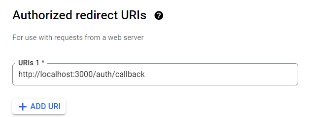

# Strac Take home test

This is a [Next.js](https://nextjs.org) project bootstrapped with [`create-next-app`](https://nextjs.org/docs/app/api-reference/cli/create-next-app).

## Getting Started

First, visit the google console and generate an [oauth key](https://developers.google.com/identity/protocols/oauth2) for your project.
Ensure you add the "Drive api" scope to allow your token to validate drive api requests

### Environment variables.

Add a .env file to the root directory of this project and add your keys from the console like so:
````
GOOGLE_CLIENT_ID=<id>
GOOGLE_CLIENT_SECRET=<secret>
REDIRECT_URL=http://localhost:3000/auth/callback
````

make sure your redirect url is specified in your client id settings on the cloud console



finally, run the development server:

```bash
npm run dev
# or
yarn dev
# or
pnpm dev
# or
bun dev
```

Open [http://localhost:3000](http://localhost:3000) with your browser to see the result.

This project uses [`next/font`](https://nextjs.org/docs/app/building-your-application/optimizing/fonts) to automatically optimize and load [Geist](https://vercel.com/font), a new font family for Vercel.

## Testing
This project uses jest and react testing library. Please run
```
npm run test
```
to kick of the jest test watcher.

## Learn More

To learn more about Next.js, take a look at the following resources:

- [Next.js Documentation](https://nextjs.org/docs) - learn about Next.js features and API.
- [Learn Next.js](https://nextjs.org/learn) - an interactive Next.js tutorial.

You can check out [the Next.js GitHub repository](https://github.com/vercel/next.js) - your feedback and contributions are welcome!

## Deploy on Vercel

The easiest way to deploy your Next.js app is to use the [Vercel Platform](https://vercel.com/new?utm_medium=default-template&filter=next.js&utm_source=create-next-app&utm_campaign=create-next-app-readme) from the creators of Next.js.

Check out our [Next.js deployment documentation](https://nextjs.org/docs/app/building-your-application/deploying) for more details.
